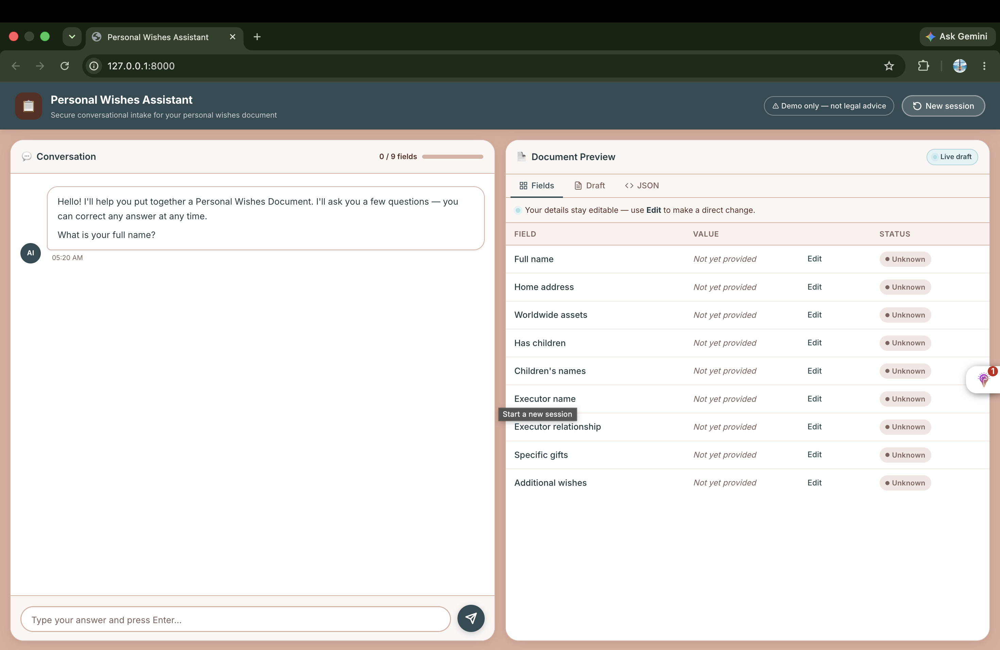
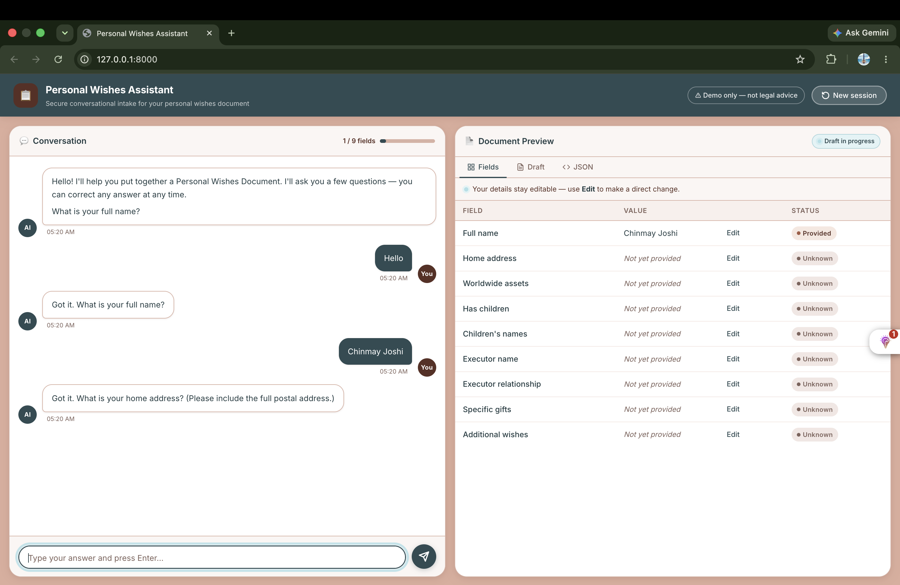
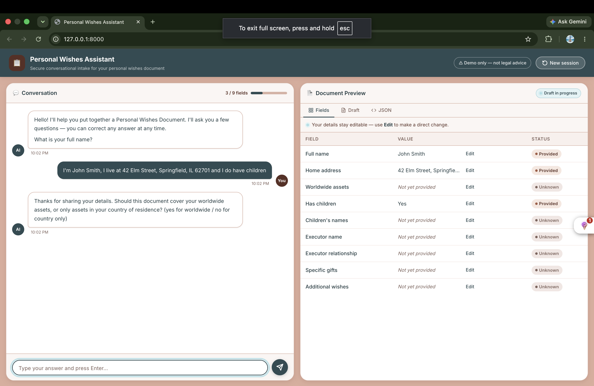
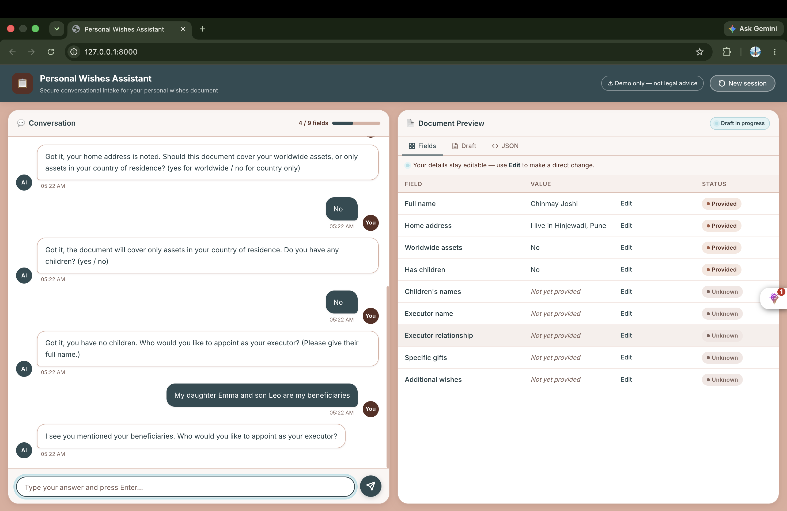
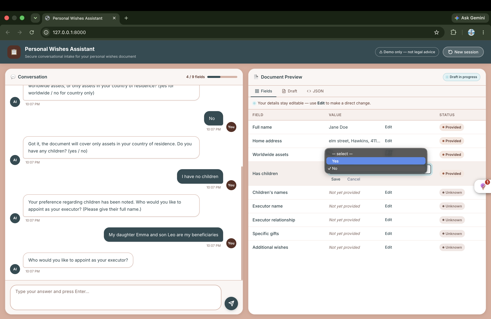
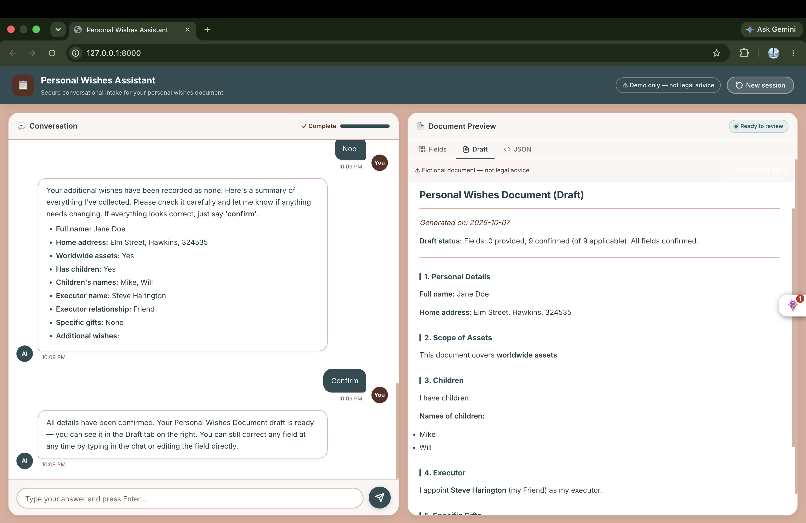
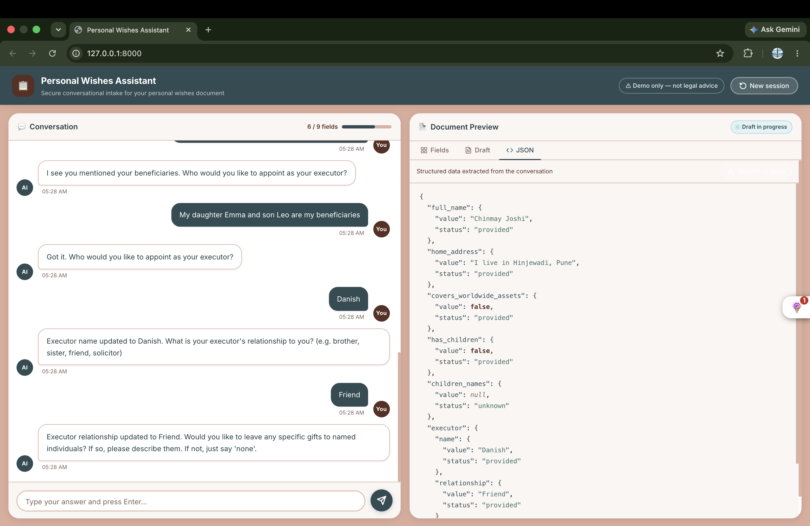
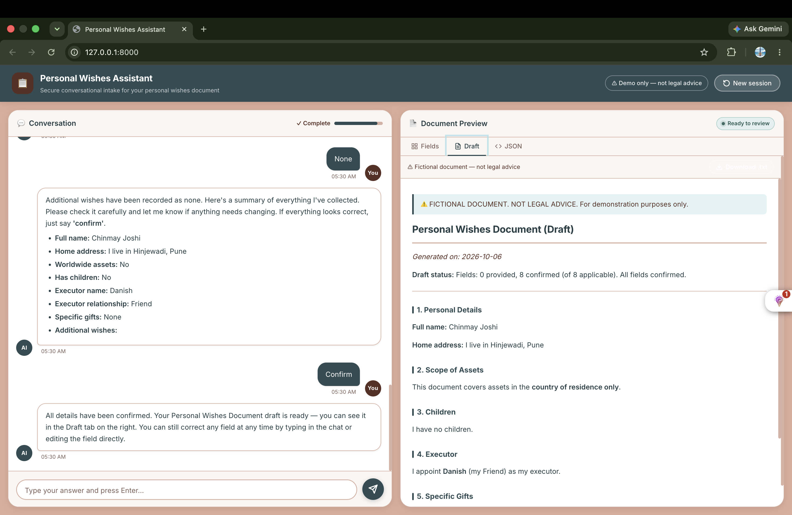

# Document Intake Assistant

A conversational assistant that interviews users to populate a structured **Personal Wishes Document**.

The core design principle is **"The LLM proposes — code decides"**:
- The LLM extracts structured update proposals from user natural language messages.
- Deterministic Python code handles all validation, type coercion, conflict detection, question progression, and document rendering.
- Structured domain state is the single source of truth; conversation transcripts are not used as state.

> **Disclaimer:** FICTIONAL DOCUMENT. NOT LEGAL ADVICE. For demonstration purposes only.

---

## Architecture

```
┌─────────────────────────────────────────────────────┐
│                   Frontend (static)                 │
│         index.html  app.js  styles.css              │
└────────────────────┬────────────────────────────────┘
                     │ HTTP
┌────────────────────▼────────────────────────────────┐
│                   api/routes.py                     │
│              (HTTP only, no business logic)         │
└────────────────────┬────────────────────────────────┘
                     │ calls
┌────────────────────▼────────────────────────────────┐
│               domain/turn.py                        │
│  (orchestrates one turn: validate→conflict→apply    │
│   →choose question→return response)                 │
├──────────┬──────────────────┬───────────────────────┤
│ updates  │   conflicts      │   questions           │
│ .py      │   .py            │   .py                 │
├──────────┴──────────────────┴───────────────────────┤
│               domain/state.py                       │
│  (WishesState, Field[T], FieldPath, helpers)        │
└─────────────────────────────────────────────────────┘
         ▲                          ▲
         │ ExtractionRequest/       │ render
         │ Response only            │
┌────────┴──────────┐   ┌──────────┴──────────────────┐
│    llm/           │   │   documents/renderer.py     │
│  base.py          │   │   (pure fn, no LLM)         │
│  groq_client.py   │   └─────────────────────────────┘
│  mock_client.py   │
│  prompts.py       │
└───────────────────┘
```

### Layering & Dependency Rules

1. **`domain/`** contains pure business logic and models. It never imports from `llm/`, `api/`, or `documents/`.
2. **`documents/`** depends solely on `domain/state.py`. It is a pure, deterministic rendering function with no clock calls or network access.
3. **`llm/`** depends only on `domain/state.py` (`FieldPath` enum). All LLM SDK dependencies (`openai`) are isolated inside `llm/groq_client.py`.
4. **`api/`** depends only on `domain/turn.py`, `domain/session.py`, and `app/config.py`. It maps HTTP requests to turn execution and serializes responses.

---

## Project Structure

```
document-intake-assistant/
├── .env.example
├── .gitignore
├── README.md
├── PRODUCTION_NOTES.md
├── AI_LOG.md
├── frontend/
│   ├── index.html          # Semantic two-column UI layout
│   ├── styles.css          # Responsive styling (no external CSS framework)
│   └── app.js              # Thin client API connector (markdown rendering, download buttons)
└── backend/
    ├── requirements.txt
    ├── pytest.ini
    ├── app/
    │   ├── __init__.py
    │   ├── config.py       # Pydantic Settings (.env configuration)
    │   ├── main.py         # FastAPI factory and static asset mounting
    │   ├── api/
    │   │   ├── __init__.py
    │   │   ├── routes.py   # REST endpoints & HTTP error mapping
    │   │   └── schemas.py  # Pydantic request/response schemas
    │   ├── domain/
    │   │   ├── __init__.py
    │   │   ├── state.py    # WishesState, FieldStatus, FieldPath
    │   │   ├── updates.py  # Update validation & evidence verification
    │   │   ├── conflicts.py# Contradiction detection & resolution
    │   │   ├── questions.py# Question bank & deterministic sequencing
    │   │   ├── session.py  # In-memory session store & audit logging
    │   │   └── turn.py     # Turn pipeline orchestration
    │   ├── documents/
    │   │   ├── __init__.py
    │   │   └── renderer.py # Pure Markdown document generator
    │   └── llm/
    │       ├── __init__.py
    │       ├── base.py          # Extraction schemas, Protocol, error hierarchy
    │       ├── prompts.py       # Prompt templates and repair prompts
    │       ├── mock_client.py   # Offline regex-based heuristic extractor
    │       └── groq_client.py   # Groq (openai/gpt-oss-20b) client with repair retry
    └── tests/
        ├── conftest.py     # ScriptedLLMClient and fixture loaders
        ├── fixtures/       # 11 deterministic scenario fixtures
        ├── test_state.py
        ├── test_renderer.py
        ├── test_updates.py
        ├── test_conflicts.py
        ├── test_questions.py
        ├── test_mock_client.py
        ├── test_turn.py
        ├── test_api.py
        └── test_groq_client.py
```

---

## Getting Started

### Prerequisites

- Python 3.9+  (tested on 3.9.6)
- pip
- A [Groq API key](https://console.groq.com/keys) (free tier available)

### Installation

1. Navigate to the backend directory and set up a virtual environment:

```bash
cd document-intake-assistant/backend
python3 -m venv .venv
source .venv/bin/activate
pip install -r requirements.txt
```

2. Configure environment variables:

```bash
cp ../.env.example .env
```

Edit `.env` to add your Groq API key:
```env
LLM_PROVIDER=groq
GROQ_API_KEY=your-groq-api-key
GROQ_MODEL=openai/gpt-oss-20b
LLM_TIMEOUT_SECONDS=20
```

---

## Running the Application

### 1. Offline / Mock Mode (No API key needed)

```bash
cd document-intake-assistant/backend
source .venv/bin/activate
LLM_PROVIDER=mock uvicorn app.main:app --reload --port 8000
```

Open http://localhost:8000 in your browser.

### 2. Groq Live Mode

```bash
cd document-intake-assistant/backend
source .venv/bin/activate
uvicorn app.main:app --reload --port 8000
```

> The `GROQ_API_KEY` and `LLM_PROVIDER` are read from `.env` automatically. You can also pass them inline:
> ```bash
> GROQ_API_KEY="gsk_..." LLM_PROVIDER=groq uvicorn app.main:app --reload --port 8000
> ```

Open http://localhost:8000 in your browser.

---

## Running Tests

Run the complete test suite (zero network calls required):

```bash
cd document-intake-assistant/backend
source .venv/bin/activate
pytest
```

---

## API Summary & Examples

### Endpoints

| Method | Path | Description |
|---|---|---|
| `GET` | `/api/health` | Health status and LLM provider configuration |
| `POST` | `/api/sessions` | Create a new intake session with greeting |
| `GET` | `/api/sessions/{id}` | Get current session state, messages, and draft |
| `POST` | `/api/sessions/{id}/messages` | Send a user message and advance the turn |
| `PATCH` | `/api/sessions/{id}/state` | Direct edit field values (bypasses evidence check) |
| `POST` | `/api/sessions/{id}/reset` | Reset state to empty |

### Example `curl` Commands

#### Create a Session
```bash
curl -X POST http://localhost:8000/api/sessions
```
Response:
```json
{
  "session_id": "019234ab-cdef-7000-8000-000000000001",
  "reply": "Hello! I will help you record your personal wishes for your document. What is your full legal name?",
  "missing_fields": ["full_name", "home_address", "covers_worldwide_assets", "has_children", "executor.name", "executor.relationship", "specific_gifts", "additional_wishes"],
  "is_complete": false
}
```

#### Send a Message
```bash
curl -X POST http://localhost:8000/api/sessions/019234ab-cdef-7000-8000-000000000001/messages \
  -H "Content-Type: application/json" \
  -d '{"message": "My name is Jane Doe and I live at 123 Main St."}'
```

#### Direct State Edit (PATCH)
```bash
curl -X PATCH http://localhost:8000/api/sessions/019234ab-cdef-7000-8000-000000000001/state \
  -H "Content-Type: application/json" \
  -d '{
    "updates": [
      {"field": "has_children", "value_bool": false}
    ]
  }'
```

---

## Key Design Decisions

1. **Propose / Decide Separation:**
   The LLM is constrained to output structured JSON adhering to `ExtractionResponse`. It cannot directly update session state or decide the next action. Python code validates all updates before applying them.

2. **Evidence Substring Verification:**
   Every proposed text or list value from the LLM must have a corresponding non-empty `evidence` quote matching a substring in the user message. This prevents hallucinations and ungrounded updates.

3. **Deterministic Question Sequencing:**
   The assistant's next question is determined strictly by evaluating `WishesState.missing_paths()` against the canonical field ordering. If the user provides multiple fields in one message, the system skips all filled fields automatically.

4. **Pure Document Rendering:**
   The markdown document generator is a deterministic function `render_document(state, date)`. It takes the current state and a date parameter with no hidden dependencies or side effects.

5. **OpenAI-Compatible Groq Integration:**
   The Groq client uses the `openai` Python SDK pointed at `https://api.groq.com/openai/v1`. This means switching to any other OpenAI-compatible provider (OpenAI, Together AI, etc.) requires only a URL and key change in `.env`.

---

## UI Walkthrough

The screenshots below show the assistant working through a complete intake session. To reproduce each case, start the app and open http://localhost:8000.

---

### Case 1 — Fresh session greeting

**Input:** Click **New session** (no message typed yet).

The assistant opens with a greeting and asks for the user's full legal name. The Fields table is empty and the progress bar shows **0 / 9 fields**.



---

### Case 2 — Single field extracted (name only)

**Input:** `My name is Jane Doe`

The assistant extracts the full name, marks the **full_name** field as **provided** in the Fields tab, advances the progress bar to **1 / 9**, and asks the next question (home address). The field status becomes **confirmed** only after the user reviews and confirms all fields at the end of the session.



---

### Case 3 — Multiple fields in one message

**Input:** `I'm John Smith, I live at 42 Elm Street, Springfield, IL 62701 and I do have children`

The assistant extracts three fields at once — **full_name**, **home_address**, and **has_children** — advances the bar to **3 / 9**, and skips directly to the next unanswered question.



---

### Case 4 — Conflict detected (contradictory answer)

**Input (first):** `I have no children`  
**Input (second):** `My daughter Emma and son Leo are my beneficiaries`

The orange **Conflict detected** banner appears below the chat, showing that the new statement contradicts the previously recorded `has_children = false`. The field is not updated until the conflict is resolved.



---

### Case 5 — Direct field edit via the Fields table

**Action:** Click the **Edit** button next to any filled field in the Fields tab, change the value, and confirm.

The field updates immediately without going through the LLM. This demonstrates the `PATCH /api/sessions/{id}/state` bypass path.



---

### Case 6 — Draft document tab

**Action:** After answering several questions, click the **Draft** tab in the right panel.

A formatted plain-English document is rendered live from the current state. The **Download .txt** button is available at the top.



---

### Case 7 — JSON structured data tab

**Action:** Click the **JSON** tab in the right panel.

The raw structured state is shown as pretty-printed JSON. The **Download .json** button is available. This is the exact object that the document renderer reads.



---

### Case 8 — Session complete

**Input:** Complete all nine fields through the conversation (or fill them via the Fields editor).

The progress bar reaches **9 / 9 fields**, the preview status chip changes to **Complete**, and the assistant confirms the document is ready to download.



---

> **To add your screenshots:** create the folder `docs/screenshots/` in the project root, capture each case, and save the files with the names shown above. The images will then render automatically in this README on GitHub.

---

## Known Limitations

- **In-Memory Session Storage:** Active sessions are held in a memory dictionary protected with `asyncio.Lock`. Server restarts will clear active sessions.
- **Single-Process Deployment:** Designed to run in a single process hosting both FastAPI endpoints and static frontend assets.
- **No User Authentication:** Intended as an intake prototype; production use requires tenant isolation and authentication.
